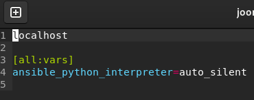
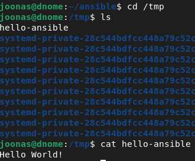

# h1 - Hei ansiblen maailma

Tehtävänanto sivustolla https://terokarvinen.com/palvelinten-hallinta

Käytössä Debian 13.4.0 Gnome, Virtualbox 7.2.4 virtualisoinnissa, Host-kone Windows 11

## x - Lue ja tiivistä

OpenSSH server ja client softat asennetaan Debian pohjaisille Linuxeille komennolla `apt install ssh` ja otetaan käyttöön komennolla `systemctl enable ssh --now`. (Karvinen 2026a.)

SSH yhteys muodostetaan komennolla `ssh user@computer`. Kun yhdistää ensimmäistä kertaa, kirjautumiseen tarvitsee salasanan. (Karvinen 2026a.) 

Avainparilla kirjautumista varten tarvitsee luoda uusi avainpari komennolla `ssh-keygen` ja sitten kopioida se kohdekoneelle komennolla `ssh-copy-id computername`. Tämän jälkeen ssh yhteys toimii ilman salasanaa. (Karvinen 2026a.) Jos avaimen luonnissa ei käytetty oletusnimeä, avain pitää määritellä erikseen käyttämällä -i flagia yhdistäessä. Esimerkki: `ssh joonas@localhost -i ~/.ssh/private-key` (man ssh.)

Ansible on hallintatyökalu joka toimii Pythonilla ssh:n yli. Hallittavat tietokoneet tarvitsevat vain nämä kaksi ohjelmaa asennettuna, jotta niitä voidaan hallita etänä. (Karvinen 2026b.)

IaC (eli Infrastructure as Code) tarkoittaa sitä, että kuvataan haluttu lopputulos, ja muutokset tehdään sen mukaan. (Karvinen 2026b.) 

Hosts.ini tiedostossa määritetään hallittavat tietokoneet. Ansible.cfg voidaan määritellä asetuksia ansibleen, esim. oletus hosts-tiedosto. Site.yml määrittelee mitkä hostit saavat mitkä roolit. Roolit ja niiden tehtävät määritellään ./roles/rolename/tasks kansioon main.yml tiedostoon. (Karvinen 2026b.)

Ansiblen konfiguraation saa ajettua komennolla ansible-playbook site.yml (Karvinen 2026b).

## a - SSH

Asentelin muutaman sovelluksen, myös ssh:n

    sudo apt update
    sudo apt install ssh ansible micro tree

Otetaan ssh palvelin käyttöön

    sudo systemctl enable ssh --now
    sudo systemctl status ssh

Kokeillaan toimiiko SSH localhostille salasanan kanssa:

    ssh joonas@localhost
    --
    w

>  13:36:42 up 8 min,  2 users,  load average: 0,17, 0,32, 0,27
> USER     TTY      FROM             LOGIN@   IDLE   JCPU   PCPU  WHAT
> joonas   pts/1    ::1              13:36    1.00s  0.03s  0.01s w
> joonas   tty2     -                13:28    8:28   0.03s  0.03s /usr/libexec/gn

2 yhteyttä muodostettu, eli ssh yhteys toimii nyt salasanan kanssa.

## b - Public key

Luodaan uusi avainpari.

    ssh-keygen

Luo oletuksena ed25519 avainparin, nimellä id_ed25519 kansioon ~/.ssh

    ssh-copy-id localhost

Salasanan syöttämisen jälkeen kokeilin uudelleen `ssh localhost` ja tällä kertaa salasanaa ei kysytty. Julkinen avain siirtyi tiedostoon ~\.ssh\authorized_keys

## c - Hei maailma, hei Ansible

Luodaan uusi kansio Ansiblea varten

    mkdir ansible
    cd ansible

Uusi tiedosto, johon lisätään hostit

    micro hosts.ini

Tiedostoon kirjoitin vain `localhost` ja tallensin sen.

Kokeillaan uptime ansiblen kanssa

    ansible all -a 'uptime' -i hosts.ini

> localhost | CHANGED | rc=0 >>
>  13:49:11 up 21 min,  2 users,  load average: 0,10, 0,06, 0,12

Muokataan hosts.ini tiedostoa, jotta Python varoitus saadaan poistettua. Sen saa poistettua  määrittämällä muuttujan ansible_python_interpreter joko /usr/bin/python3 tai auto_silent (Ansible 2026).

Nyt kun ajaa tuon uptime komennon ansiblella, ei python viestiä enää tule.

Luodaan config tiedosto, ansible.cfg, jonne määritetään Ansible oletusarvoisesti käyttämään hosts.ini tiedostoa.

    [defaults]
    inventory = hosts.ini

Nyt voi ajaa komennon ``ansible all -a "uptime"`` ilman että hosts.ini tiedostoa tarvitsee määrittää komennossa. 

Luodaan uusi tiedosto, site.yml ja määritellään sinne rooli hello.

    - hosts: all
      roles: 
        - hello

Sitten kokeillaan ajaa pelikirja ansible-playbookilla

    ansible-playbook site.yml

    [ERROR]: the role 'hello' was not found in /home/joonas/ansible/roles:/home/joonas/.ansible/roles:/usr/share/ansible/roles:/etc/ansible/roles:/home/joonas/ansible
    Origin: /home/joonas/ansible/site.yml:3:7

    1 - hosts: all
    2   roles: 
    3     - hello
            ^ column 7

Luodaan rooli. Sitä varten luodaan alikansioita ansible-kansioon. 

    mkdir -p roles/hello/tasks

Sitten luodaan main.yml, joka sisältää koodin, jonka rooli ajaa automaattisesti. 

    micro roles/hello/tasks/main.yml

main.yml sisältö:

    - copy
        dest: /tmp/hello-ansible
        content: "Hello World!\n"

Ajetaan pelikirja uudelleen

    ansible-playbook site.yml

Sain virheilmoituksen: 

    [ERROR]: YAML parsing failed: Mapping values are not allowed in this context.
    Origin: /home/joonas/ansible/roles/hello/tasks/main.yml:2:9

    1 - copy
    2     dest: /tmp/hello-ansible
              ^ column 9

Ilmeisesti väärä syntaksi? Kuitenkin tunnistaa oikean tiedoston.

Huomasinkin että kaksoispiste puuttui riviltä 1. Kun korjasin sen, ansible-playbook meni läpi.

> PLAY [all]
> 
> TASK [Gathering Facts]
> ok: [localhost]
>
> TASK [hello : copy] 
> changed: [localhost]
>
> PLAY RECAP 
> localhost                  : ok=2    changed=1    unreachable=0    failed=0    skipped=0    rescued=0    ignored=0

Käydään tarkistamassa, onko tiedosto mennyt /tmp -kansioon.

    cd /tmp
    ls
    cat hello-ansible

Kun pelikirja ajetaan uudestaan, ei Ansible tee enää uusia muutoksia.

> localhost                  : ok=2    changed=0    unreachable=0    failed=0    skipped=0    rescued=0    ignored=0

(Karvinen 2026b.)

Lähdeluettelo: 

Ansible Documentation. 2026. Interpreter Discovery. Luettavissa: https://docs.ansible.com/projects/ansible-core/2.19/reference_appendices/interpreter_discovery.html

Karvinen, T. 2026a. SSH public key - Login without password. Luettavissa: https://terokarvinen.com/ssh-public-key-login-without-password/

Karvinen, T. 2026b. Hello Ansible. Luettavissa: https://terokarvinen.com/hello-ansible/

Man ssh. ssh - OpenSSH remote login client. OpenBSD manual page server. Luettavissa https://man.openbsd.org/ssh