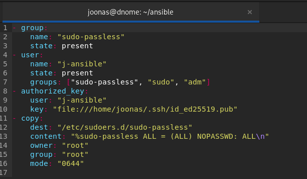
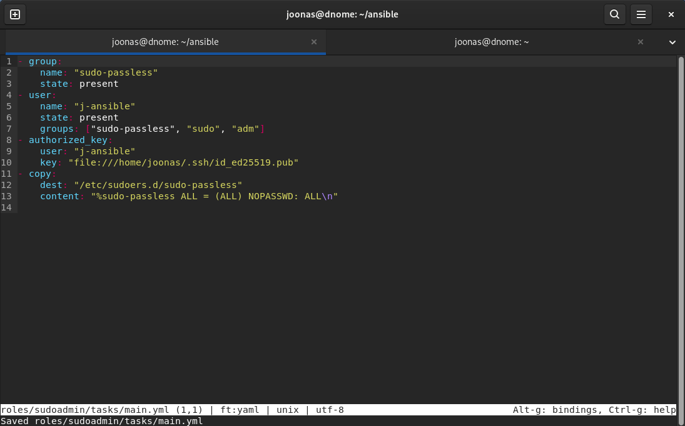
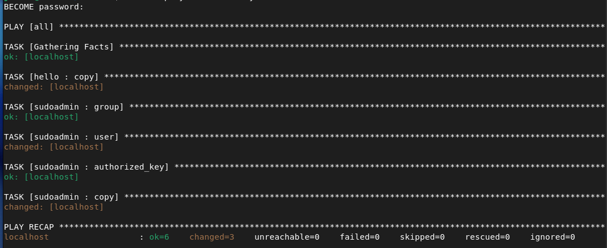
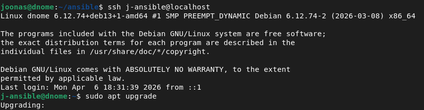
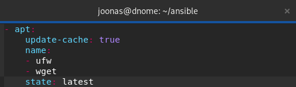
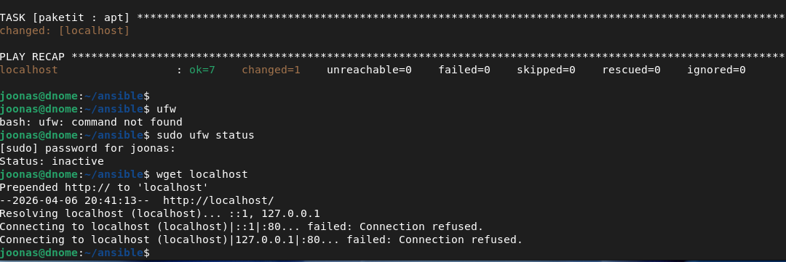
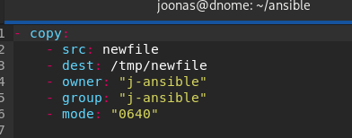
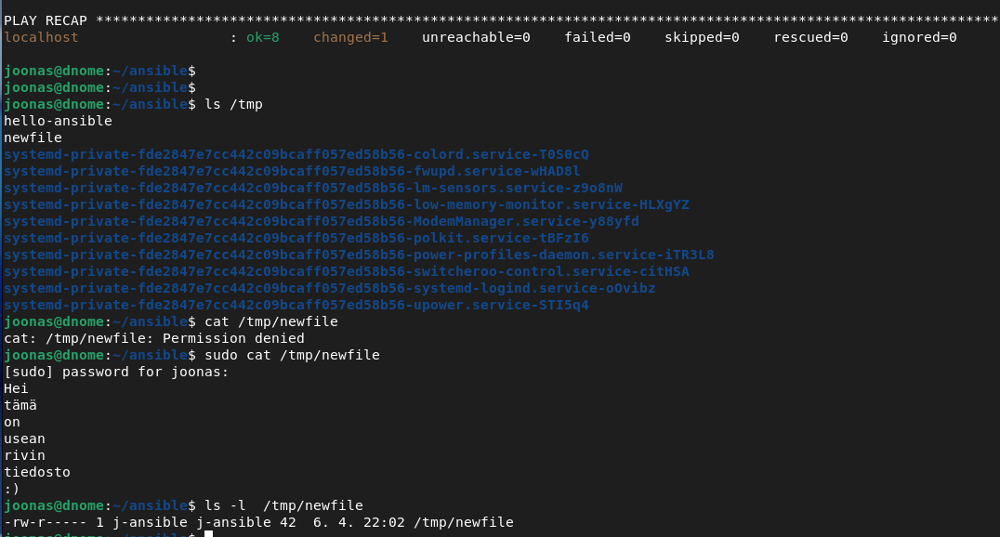
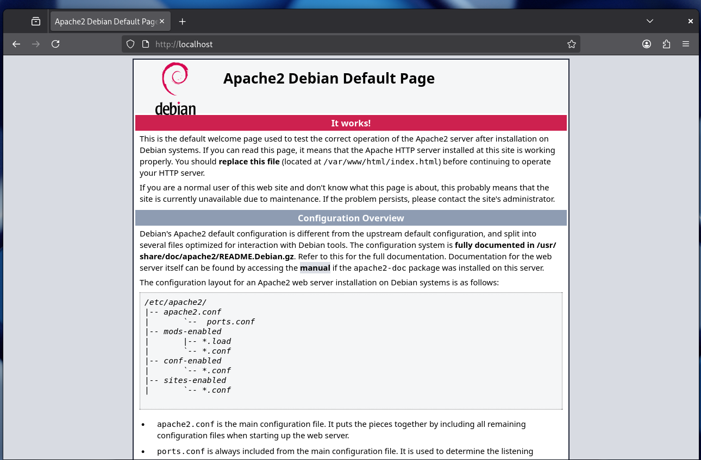

Tehtävänanto sivustolla https://terokarvinen.com/palvelinten-hallinta/

## x - lue ja tiivistä

- Sudon käyttämisen sääntöjä voidaan muokata sudoers-säännöillä kansiossa /etc/sudoers.d/

- Salasanattomaan sudon käyttöön kannattaa luoda oma ryhmä (Karvinen 2026a.)

- Salasanattoman sudon käyttöoikeuksia ei kannata antaa käyttäjälle, jolla koneelle kirjaudutaan.

- Ansiblella voidaan ottaa käyttöön salasanaton sudo hallittavissa koneissa

- Ensimmäistä kertaa ajettaessa pelikirjaa, jossa luodaan käyttäjä salasanattomalle sudolle, tarvitsee antaa sudo-salasana flagilla `--ask-become-root` (Karvinen 2026b.)

- `ansible-doc copy` kopioi tai luo tiedoston hallittavalle koneelle. 
  - `content` määrittelee tiedoston sisällön
  - `dest` absoluuttinen sijainti, jonne kopioidaan
  - `src` paikallisen koneen sijainti, josta kopioidaan. Oletuksena kopioi rekursiivisesti
  - `owner` määrittää tiedoston omistajan
  - `group` määrittää tiedoston ryhmän. Oletusarvoisesti käyttää omistajan oletusryhmää
  - `mode` tiedoston käyttöoikeudet merkittyinä numeroin (r=4,w=2,x=1). Ansiblessa numeron edessä pitää olla 0. Uudemmissa  versioissa voidaan käyttöoikeudet ilmaista myös symboolisena (esim. ugo+rwx). Mode voi olla myös `preserve`, joka käyttää samoja oikeuksia kuin tiedoston ylähakemisto (Ansible Docs 2026.)

- `ansible-doc apt` hallitsee apt paketteja
  - `name` lista pakettien nimistä, ja toivotusta versiosta
  - `state` paketin toivottu tila, esim. `latest` on paketin viimeisin versio
  - `update_cache` ajaa kohdekoneella `apt-get update`. Voidaan käyttää asennuskomennon yhteydessä tai erikseen. (Ansible Docs 2026.)

- `ansible-doc file` hallitsee ja muokkaa tiedostoja
  - `path` hallittavan tiedoston sijainti
  - `recurse` kun hallittava tiedosto on kansio, asetusmuutokset otetaan käyttöön rekursiivisesti
  - `src` linkitettävän tiedoston sijainti. Linkitys toimii kuin bashin `ln`
  - `state` hallittavan tiedoston toivottu tila, esim `absent` poistaa tiedoston, `file` muokkaa tiedostoa ja `touch` luo tiedoston, jos sitä ei ole (Ansible Docs 2026.)

- `ansible-doc user` hallitsee linux/unix käyttäjiä
  - `create_home` luodaanko käyttäjälle kotihakemisto. Oletus=true
  - `state` määritellään, onko käyttäjä olemassa (present) vai ei (absent)
  - `system` määrittelee, luodaanko system-käyttäjä. (Ansible Docs 2026.) System-käyttäjä on tili, jolle ihminen ei kirjaudu, vaan se on jonkin demonin tai ohjelman käytössä (GeeksForGeeks 2025). 

- `ansible-doc authorized_key`
  - `user` hallittavan koneen käyttäjä, jonka authorized_keys tiedostoa muokataan
  - `key` ssh julkinen avain, tai tiedosto, jossa avain on.

## a - Sudoless

Luodaan ensin uusi käyttäjä ja uusi ryhmä

    sudo adduser j-ansible
    sudo groupadd sudo-passless
    sudo adduser j-ansible sudo-passless

Avasin uuden välilehden Terminaaliin ja avasin root-terminaalin komennolla `sudo -i` siltä varalta, että jokin menee pieleen.

    sudo visudo /etc/sudoers.d/sudo-passless

Käyttää Nanoa editorina, mutta kyllä sen kanssa selviää.

    %sudo-passless ALL = (ALL) NOPASSWD: ALL

Kokeillaan sitten toimiiko:

    ssh j-ansible@localhost

    sudo apt update

Salasanaa ei kysytty, eli toimii. Kopioin ssh avaimen vielä käyttäjän authorized_keys tiedostoon.

    ssh-copy-id j-ansible@localhost

Nyt salasanaa ei kysytä kirjautuessa.

## b - Antero

Tunnuksen luominen ansiblella. 

Luodaan tarvittavat kansiot ja tiedostot.

main.yml tiedoston sisältö. Tämä luo uuden ryhmän, "sudo-passless", uuden käyttäjän, "j-ansible", lisää paikallisen ssh-avaimen authorized_key tiedostoon ja luo konfiguraatiotiedoston kansioon /etc/sudoers.d/. 0644 tarkoittaa RW-R--R-- oikeuksia.

site.yml tiedostoon lisätään uusi rooli ja become root käsky.

    - hosts: all
      become: true
      roles: 
        - hello
        - sudoadmin

Sitten ajoin `ansible-playbook -K site.yml` ja katsoin toimiiko.

Pelikirja meni läpi ilman virheitä.

Ja ssh toimii edelleen, uudella käyttäjällä ilman salasanaa.

## c - Package

Loin uuden roolin, "paketit"

    mkdir -p roles/paketit/tasks

Roolin main.yml tiedosto 

Tämä rooli asentaa ufw:n ja wgetin viimeisimmän version. 

Seuraavaksi muokkasin site.yml tiedostoa, niin että se sisältää myös tämän roolin "paketit".

Ajoin pelikirjan ja testasin asentuivatko sovellukset koneelleni.

Sovellukset ovat asentuneet. 

## d - File

Loin uuden roolin, "newfile". Loin alikansioon tasks main.yml tiedoston ja alikansioon files tiedoston nimeltä newfile. 

Main.yml:

Rooli kopioi newfile tiedoston orjan /tmp/ kansioon. 0640 tarkoittaa, että omistajalla on luku ja kirjoitusoikeudet, ryhmällä on lukuoikeudet ja muilla ei ole mitään oikeuksia. 

Muokkasin site.yml sisältämään newfile roolin.

Ajoin komennon `ansible-playbook -K site.yml` ja sain virheilmoituksen: 

    [ERROR]: unexpected parameter type in action: <class 'ansible.module_utils._internal._datatag._AnsibleTaggedList'>
    Origin: /home/joonas/ansible/roles/newfile/tasks/main.yml:1:3

    1 - copy:
    ^ column 3

Kokeilin laittaa polkujen nimet heittomerkkeihin. Siitä ei ollut apua.

Poistin viivat copy komennon parametreiltä. Tämän jälkeen alkoi toimimaan.

newfile kopioitui tmp kansioon: 

## e - Jotain muuta

Moduuli `systemd_service` mahdollistaa daemonien hallinnan (Ansible Docs 2026). Kokeilen uudella roolilla "apache" asentaa Apache2:n ja ottaa Apache2 palvelun käyttöön.

roles/apache/tasks/main.yml

  - apt:
    update-cache: true
    name: "apache2"
    state: latest

  - systemd_service:
    name: "apache2"
    enabled: true
    state: "started"

Lisäsin roolin "apache" site.yml tiedostoon ja ajoin pelikirjan.

Pelikirja meni läpi ja apache2 asentui onnistuneesti.

Lähteet: 

Karvinen, T. 2026a. Sudo without password. https://terokarvinen.com/passwordless-sudo/

Karvinen, T. 2026b. Passwordless Sudo with Ansible. https://terokarvinen.com/passwordless-sudo-with-ansible/

Ansible Docs 2026. Ansible Documentation. Luettavissa: `ansible-doc` [moduulin nimi] tai https://docs.ansible.com/projects/ansible/latest/

GeeksForGeeks 2025. Users in Linux System Administration. https://www.geeksforgeeks.org/linux-unix/users-in-linux-system-administration/ 

