Tehtävänanto sivustolla https://terokarvinen.com/palvelinten-hallinta/

## x - lue ja tiivistä

Karvinen 2026: https://terokarvinen.com/apache-ansible/

- Tässä esimerkissä Apache käynnistetään uudelleen vain jos muutoksia on tehty konfiguraatiotiedostoon

Ansible Community Documentation: https://docs.ansible.com/projects/ansible/latest/playbook_guide/playbooks_handlers.html

- Notify ilmoittaa handlerille, mikä task pitää tehdä

ansible-doc service

- service-moduulilla voi hallita palveluita hallittavissa laitteissa. On "proxy" muille palvelunhallinta moduuleille, kuten systemd:lle.

- enabled: lähteekö käyntiin bootin aikana (true/false)
- name: palvelun/daemonin nimi
- state: started/stopped on idempotentteja, eivät muuta tilannetta, jos on jo päällä tai pois. Restart/reload suorittaa toiminnon joka kerta.

## a - pache2

Poistan aluksi aiemmin tunnilla asentamani apache2 ja nginx

    sudo apt-get purge apache2 nginx 

Asennetaan Apache2

    sudo apt install apache2

Luodaan käyttäjälle kansio, johon verkkosivu luodaan

    mkdir -p /home/joonas/Websites/kotisivu

Tarkastetaan oikeudet

    ls -l /home/
    ls -l /home/joonas

    drwx--x--x 21 joonas    joonas    4096 13. 4. 18:10 joonas

    drwxrwxr-x 3 joonas joonas 4096 13. 4. 18:10 Websites

Tehdään asetustiedosto kopioimalla oletussivu ja muokkaamalla sitä

    cd /etc/apache2/sites-available
    sudo cp 000-default.conf kotisivu.conf
    sudoedit kotisivu.conf

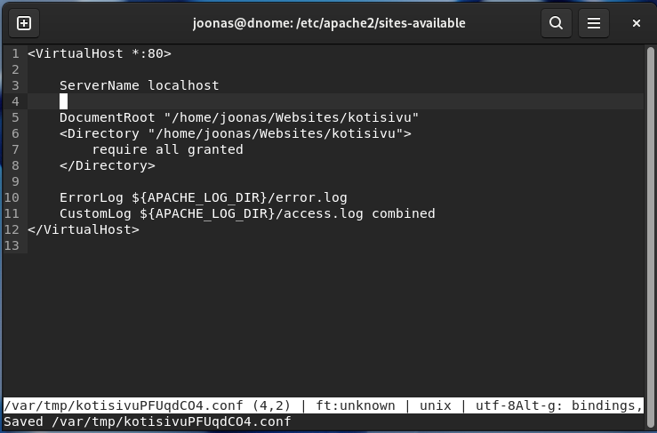

Luodaan index.html

    micro /home/joonas/Websites/kotisivu/index.html

Tarkastetaan oikeudet

    ls -l
    
    -rw-rw-r-- 1 joonas joonas 56 13. 4. 18:47 index.html

Read oikeudet pitäisi riittää index.html sivustoon.

Disabloidaan default site, otetaan käyttöön uusi sivusto.

    sudo a2dissite 000-default.conf
    sudo a2ensite kotisivu.conf
    sudo systemctl restart apache2

Sivusto toimii:

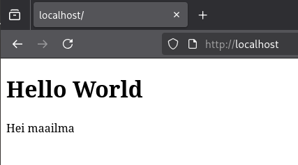

## b - nginx

Sammutetaan apache2 daemon, sitten asennetaan nginx ja laitetaan se päälle

    sudo systemctl disable apache2 --now
    sudo apt install nginx
    sudo systemctl enable nginx --now

Tarkistetaan asetustiedostot ja laitetaan se osoittamaan samaan kansioon

    cd /etc/nginx/sites-available
    sudo cp default kotisivu
    sudoedit kotisivu

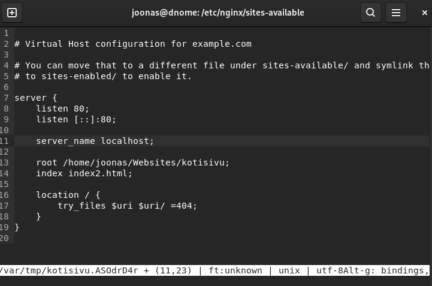

Luodaan konfiguraatiotiedostossa mainittu index2.html tiedosto. Kopioin aiemmin luomani index.html tiedoston ja muokkaan sitä.

    cd /home/joonas/Websites/kotisivu/index2.html
    cp index.html index2.html
    micro index2.html

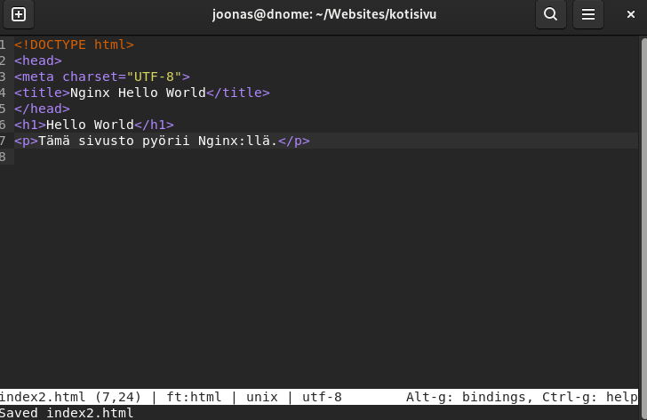

Otetaan uusi sivu käyttöön ja käynnistetään nginx palvelu uudelleen.

    sudo ln -s /etc/nginx/sites-available/kotisivu kotisivu
    ls

        default  kotisivu

    sudo rm default
    sudo systemctl restart nginx

Avataan localhost selaimessa

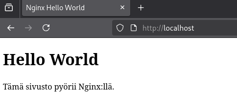

## c - automoottorix

Automatisoidaan webbisivun asennus ansiblella, ylläpitäjän osuus. 

    micro ~/ansible/roles/nginx/tasks/main.yml

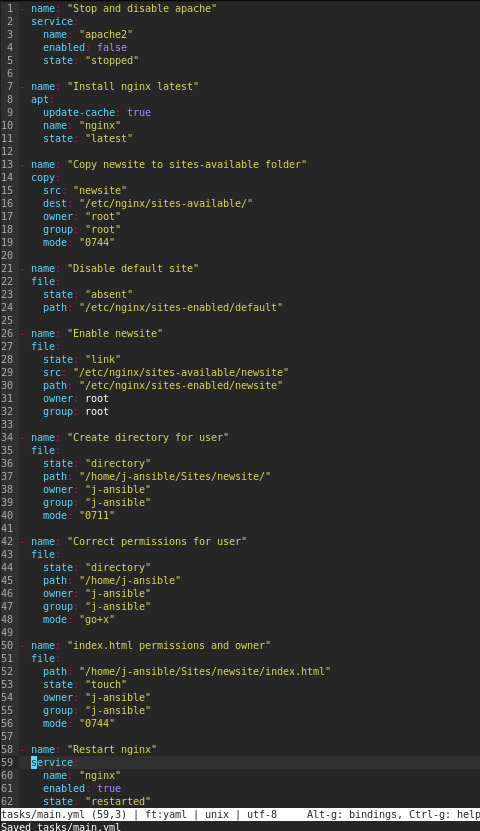

Tehtävien nimet kertovat mitä tässä roolissa tapahtuu:
- Ensin sammutetaan apache2, jos se on päällä, ja varmistetaan ettei käynnisty bootin yhteydessä
- Asennetaan uusin nginx. `Update-cache: true` ajaa `apt-get update` jotta uusin versio tulee varmasti
- Kopioidaan konfiguraatiotiedot sites-available kansioon
- Poistetaan käytöstä default sivu `file state: absent`
- Luodaan symlink uuteen sivustoon
- Varmistetaan että konfiguraatiotiedostossa oleva kansio ja index.html ovat luotu, ja että oikeudet ovat kunnossa.
- Lopuksi käynnistetään nginx uudelleen

Alla sivusto joka kopioidaan kohdekoneelle

    micro ~/ansible/roles/nginx/files/newsite

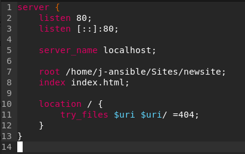

Eli muokattava html-tiedosto on käyttäjällä j-ansible.

Lopputuloksena pitäisi tulla toimiva sivusto.

Testataan pelikirjaa, lisätään ensiksi rooli site.yml pelikirjaan.

    ansible-playbook --user j-ansible --become site.yml

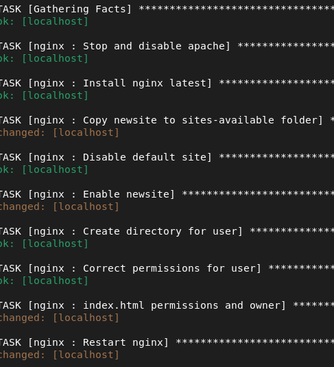

Edelleen aiemmin luomani sivu pyörii localhostissa. 

Jos haluaisi, että kaikki aikaisemmat sivustot, jota on otettu käyttöön nginx:llä poistetaan, pitää "Disable default site" taskin tilalle laittaa `state: absent` `path: /etc/nginx/sites-enabled/*`. Kokeillaan sitä.

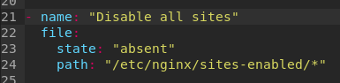

Tämä ei tyhjentänytkään kansiota. Ilmeisesti pitää poistaa koko kansio ja luoda uusi tilalle, jos haluan tyhjentää sen täysin. Toinen vaihtoehto olisi ajaa shell skripti. 

Lähde: https://stackoverflow.com/questions/38200732/ansible-how-to-delete-files-and-folders-inside-a-directory

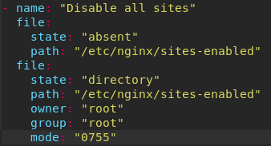

Vieläkin pielessä, pitää erottaa file-taskit toisistaan

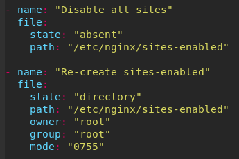

Nyt sivusto päivittyi!

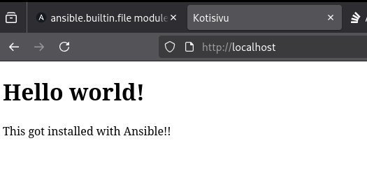

Lisätään handlereita niin että sites-enabled kansio tyhjennetään vain, jos newsite-sivu muuttuu

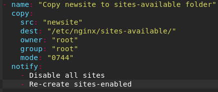

Ei "kosketa" joka kerta index.html tiedostoon, vain silloin, kun kansio luodaan ensimmäistä kertaa, tai sen oikeuksia muokataan.

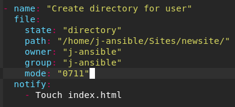

Restart nginx vain silloin, kun sivusto enabloidaan.

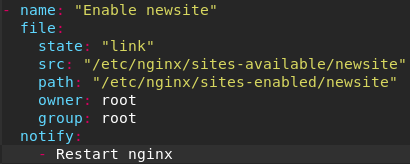

Handlers-tiedosto: 

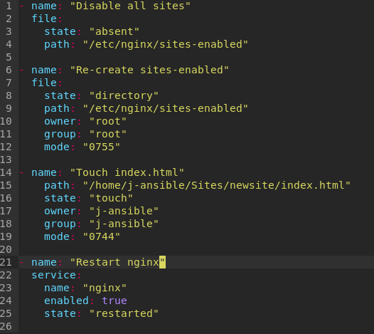

Nyt muutoksia ei tapahtunut, kun kaikki asiat ovat jo kunnossa. 

    PLAY RECAP
        localhost                  : ok=12   changed=0    unreachable=0    failed=0    skipped=0    rescued=0    ignored=0