# H4 - Pizza Fantasia

Tehtävänanto sivustolla https://terokarvinen.com/palvelinten-hallinta/

## x - Lue ja tiivistä

4.12.1 Size and Complexity of Some DSLs (Karvinen 2024, 112.)

- DSL = Domain Specific Language. CM = Configuration Management
- Eri konfiguraationhallintatyökaluilla on omat tavat suortitaa hallintaa. 
- Ominaisuuksia on paljon ja manuaalit ovat niin pitkiä, ettei kukaan pysty lukemaan niitä kokonaan.

4.12.2 Use of DSL Functions in Case Configuration (Karvinen 2024, 112-115.)

- Kaikkea ei tarvitse opetella ulkoa, koska pieni määrä komentoja kattaa suurimman osan koodista
- Package-File-Service mallin komennot ovat käytetyimpien joukossa

4.12.3.1 Dependencies Between Main Functions (Karvinen 2024, 115-117.)

- Järjestelmä on ideaalisti idempotentti, eli muutoksia ei tehdä kun järjestelmä on jo halutussa tilassa

## a - Räpylä

Päivitän ensiksi paketit ja asensin sitten UFW koneelle.

    sudo apt update
    sudo apt upgrade
    sudo apt install ufw

Tarkastin UFW:n asetustietoja kansiossa `/etc/ufw`. Palomuurin saa kytkettyä päälle ufw.conf tiedostosta, ja ufw komennolla lisätyt säännöt tulevat `user.rules` ja `user6.rules` kansioon.

Lisätään sääntö joka hyväksyy ssh yhteydet koneelle

    sudo ufw allow ssh

Poistin sitten säännön käsin `user.rules` tiedostosta mutta en `user6.rules` tiedostosta

user.rules

    ### tuple ### allow tcp 22 0.0.0.0/0 any 0.0.0.0/0 in
    -A ufw-user-input -p tcp --dport 22 -j ACCEPT

Laitoin palomuurin päälle `sudo ufw enable` ja tarkistin tilanteen `sudo ufw status` komennolla

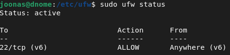

IPv4 sääntö on pois mutta IPv6 sääntö on vielä. 

Poistin kaikki säännöt ja kokeilin lisätä IPv4 portti 22 säännön eri nimellä

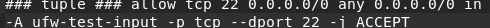

Ei toiminut. Katsotaan netistä miten toimii. Tuota "ufw-user-input" kohtaa ei voi muokata, vaan siinä käytettävät "nimet" on ennalta määrätty. (Ubuntu 2023, Arch Linux Wiki 2025.)

Miettien automatisointia, ehkä helpoin tapa olisi tarkistaa user.rules tiedostosta, että porttiin 22 hyväksytään liikenne, ja jos ei, komento `ufw allow 22` ajetaan. Toinen vaihtoehto on kopioida halutut palomuurisäännöt master-koneelle ja varmistaa, että asetustiedostot ovat kunnossa orjilla.

## b - Automaatti

Poistin ufw:n komennolla `sudo apt purge ufw` ja asensin sen uudelleen. Tein joitain palomuurisääntöjä, kuten allow ssh http https. Kopioin asetustiedostot `before.rules` `user.rules` `ufw.conf` ansible-roolin files kansioon. Jossain tilanteissa voisi olla hyvä kopioida kaikki asetustiedostot, ettei mitään palomuuriin liittyvää voida muokata. 

Muutin tiedostojen omistajan roolin ufw files-kansiossa `sudo chmod joonas:joonas *`

Ansible roolin ufw, `tasks/main.yml` tiedosto

    - name: UFW systemd enabled
      service: 
        name: ufw
        enabled: true
        state: started

    - copy:
        src: user.rules
        dest: /etc/ufw/
        owner: root
        group: root
        mode: 0640
      notify:
        - Restart ufw

Sama copy toistuu jokaiselle tiedostolle. Ufw daemon pitää olla päällä kokoajan, mutta itse palomuuri laitetaan päälle vasta asetustiedostoissa. Jos jokin asetustiedosto muuttuu, ufw käynnistetään uudelleen.

`handlers/main.yml`

    - name: Restart ufw
      service: 
        name: ufw
        enabled: true
        state: restarted

Muokkasin site.yml tiedostoa niin, että ufw rooli ajetaan

    ansible-playbook site.yml --become -u j-ansible

2 muutosta tapahtui

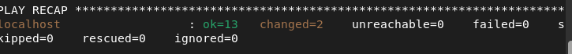

Tarkastetaan, onko palomuuri nyt päällä. Se ei aiemmin ollut. 

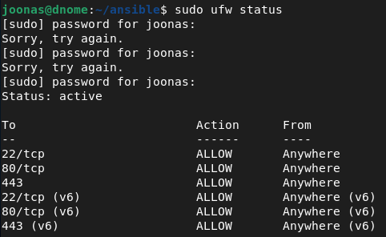

Vaikuttaa hyvältä.

## c - Asetus

Poistin herran asetustiedostosta ssh säännön IPv6 kautta. 

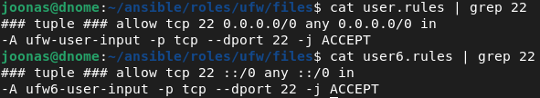

Ajoin pelikirjan uudestaan 

    ansible-playbook site.yml --become -u j-ansible

2 muutosta taas. Tarkastetaan palomuurin tila `sudo ufw status`

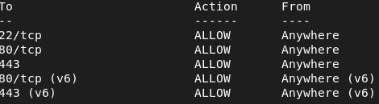

IPv6 sääntö portille 22 poistui.

## d - Paikka remonttiin 

Poistetaan ufw komennolla `sudo apt purge ufw` ja ajetaan pelikirja uudestaan `ansible-playbook site.yml --become -u j-ansible`

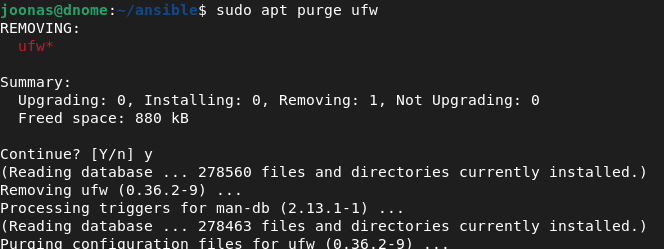

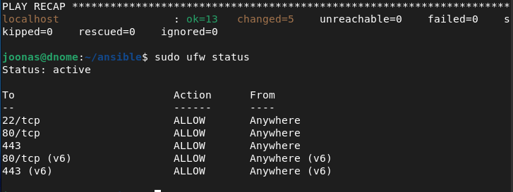

Kokeilin poistaa kaikki asetustiedostot ja katsoin mitä tapahtuu kun pelikirja ajetaan.

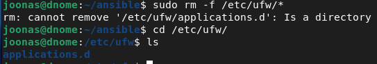

Kävi vähän kuin oletinkin. Kaikkia asetustiedostoja ei olla määritelty, joten daemon ei lähde käyntiin.

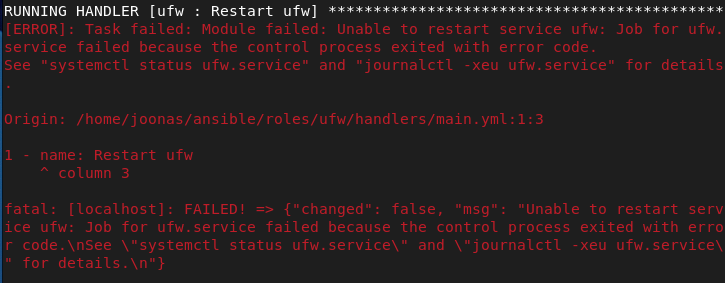

Asensin ufw:n uudelleen ja kopioin muutkin asetustiedostot talteen (paitsi applications.d -kansion) ja muutin omistajan `sudo chown joonas:joonas files/*` komennolla.

Muutin tasks tiedostoa niin, että jokaiselle tiedostolle ei tarvitse tehdä omaa taskia. (Finch 2025.) 

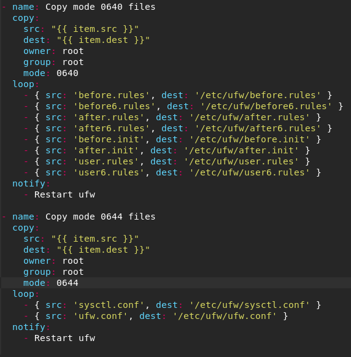

Kokeilin sitten ajaa pelikirjan. Meni läpi ilman virheitä. Sörkitään asetustiedostoja ja katsotaan jos ansible saa ne korjattua.

    sudo rm -f /etc/ufw/*

Asetustiedostot ainakin kaikki kirjoitettiin uudelleen, eikä pelikirja palauttanut virhettä. Palomuuri on myös kunnossa

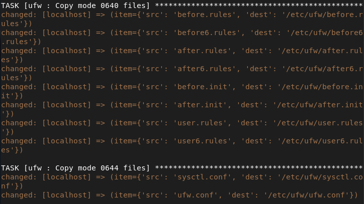

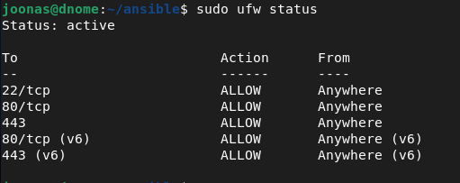

## e - Idempotentti

Kun ajan pelikirjan uudestaan, kaikki on OK eikä muutoksia tehdä.

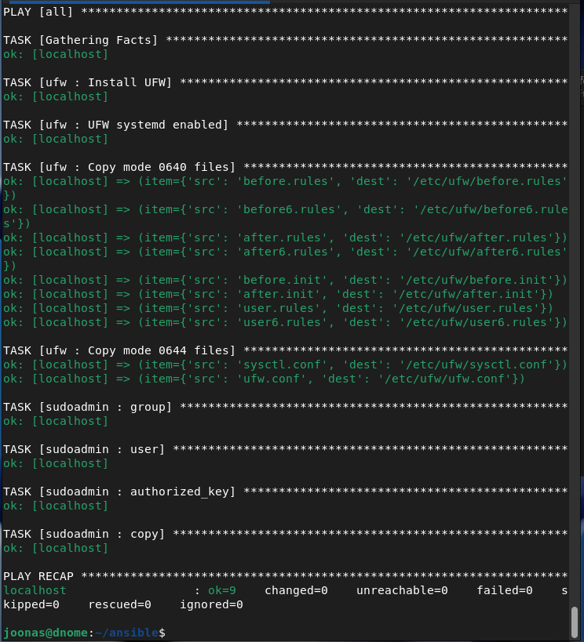

Lähdeluettelo: 

Finch, H. 2025. Copy multiple files with Ansible. Medium.com. Luettavissa: https://medium.com/@haroldfinch01/copy-multiple-files-with-ansible-88d5d8b10ad7

Karvinen, T. 2024. Configuration Management of Distributed Systems over Unreliable and Hostile Networks. University of Westminster. Luettavissa: https://doi.org/10.34737/w7vvz

Arch Linux Wiki. 2025. Uncomplicated Firewall. https://wiki.archlinux.org/title/Uncomplicated_Firewall

Ubuntu Documentation. 2023. UFW. https://help.ubuntu.com/community/UFW