# h5 - Gitar Hero

Tehtävänanto sivustolla https://terokarvinen.com/palvelinten-hallinta/

## x - Lue ja tiivistä

Chacon and Straub 2014: https://git-scm.com/book/en/v2/Getting-Started-What-is-Git%3F

- Git on versionhallintajärjestelmä (VCS)
- Ei tallenna tiedostoissa tapahtuneita muutoksia, vaan tallentaa snapshotin aina kun committaa.
- Järjestelmä toimii lähes kokonaan paikallisesti, internetyhteys ei ole pakollinen
- Kun jotain committaa gitiin, sitä on hyvin vaikea menettää

git add --all

- `git add` merkkaa valitut tiedostot lisättäväksi seuraavaan commit:iin. `git add --all` merkkaa kaikki tiedostot, joissa on tapahtunut muutoksia. 

git commit

- `git commit` tallentaa aiemmassa vaiheessa lisätyt tiedostot paikalliseen snapshot tietokantaan

git pull

- `git pull` hakee uusimman version ulkoisesta tietovarastosta (repository) ja yhdistää muut tehdyt muutokset paikalliseen git-tietokantaan

git push

- `git push` lataa viimeisimmän commitin ulkoiseen tietovarastoon

(Chacon & Straub 2014.)

## a - Online

Hain verkosta Githubin korvikkeita, ja löysin sivuston https://codeberg.org. Codeberg on Berliinissä hostattu tietovarastoalusta, jonka on luonut voittoa tavoittelematon organisaatio (https://docs.codeberg.org/getting-started/faq/)

Loin tilin Codebergiin ja loin uuden tietovaraston 

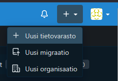

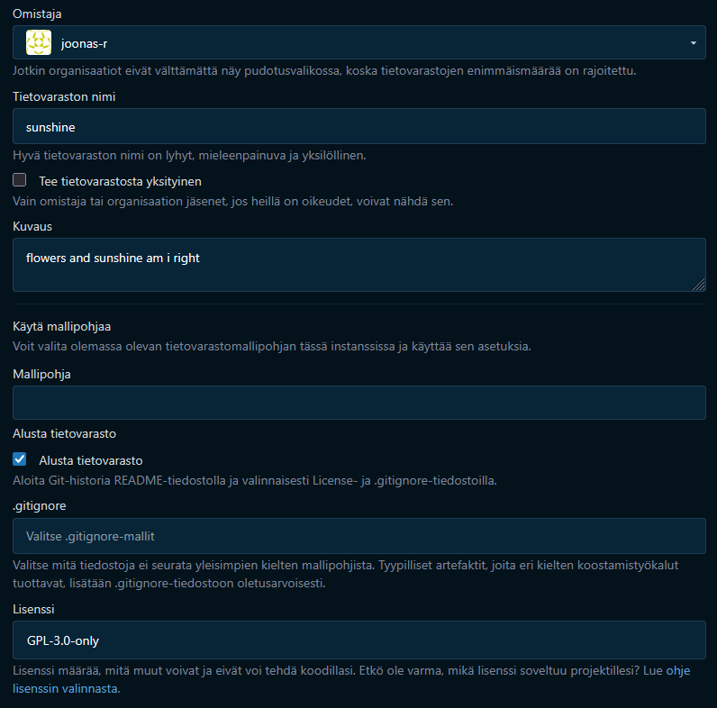

## b - Dolly

Kloonataan varasto. Lisäsin ensin tietokoneeni SSH julkisen avaimen Codebergin käyttäjätietoihin.

Ensin kopioin SSH julkisen avaimen omalta koneelta:

    cd ~/.ssh
    cat avain.pub

Codebergissä menin screenshottien mukaisesti asetuksiin ja lisäsin SSH avaimen sinne:

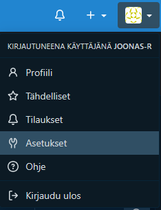

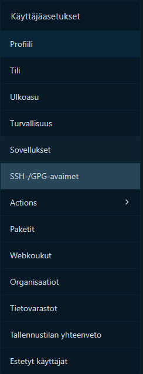

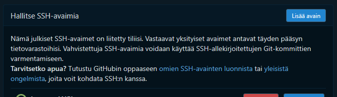

Seuraavaksi menin takaisin sunshine-tietovarastoon, ja hain linkin SSH:lle

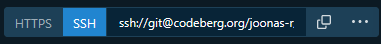

Kopioin Git-tietovaraston omalle koneelleni komennolla:

    git clone ssh://git@codeberg.org/joonas-r/sunshine.git

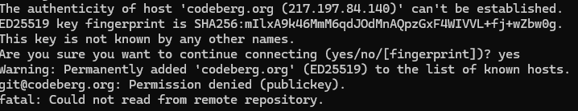

En käyttänyt oletusavainta vain avaimen nimi on AVAIN-desktop, joten identity file pitää erikseen määrittää käyttämään oikeaa avainta. Teen sen tällä kertaa muokkaamalla .ssh/config tiedostoa, niin että se käyttää oletuksena aina AVAIN-desktop avainta.

    IdentityFile ~/.ssh/AVAIN-desktop

Tämän jälkeen `git clone ssh://git@codeberg.org/joonas-r/sunshine.git` toimi.

Loin paikallisesti tiedoston hello.py ja ajoin git komennot:

    git add hello.py
    git commit

Pitää määrittää tiedot, kuka on tekemässä muutoksia

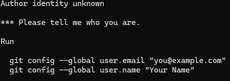

    git config --global user.email "sähköpostiosoite"
    git config --global user.name "Joonas Ristola"

Sitten kokeilin uudestaan `git commit`. Aukesi tekstieditori, johon kirjoitin commit viestin. Kun suljin tiedoston, komento meni loppuun onnistuneesti

    [main 2251f5b] added hello.py
    1 file changed, 5 insertions(+)
    create mode 100755 hello.py

Seuraavaksi puskin commitit ulkoiseen tietovarastoon. Koska kukaan ei ole tehnyt muutoksia, `git pull` ei ole pakollinen, mutta ajoin sen kuitenkin ennen `git push` komentoa.

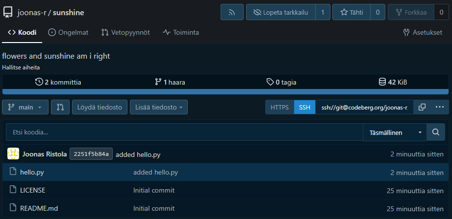

## c - Doh!

Loin tiedoston supersalainendokumentti.txt kansioon, ja hätäpäissäni poistin kaikki tiedostot, koska supersalainendokumentti ei saa tulla näkyviin julkisesti.

    micro supersalainendokumentti.txt
    ls
        hello.py  LICENSE  README.md  supersalainendokumentti.txt
    rm *
    ls -a
        . .. .git

Nyt tiedostot on poistettu, vain .git tiedosto jäi

    git reset --hard
    ls
        hello.py  LICENSE  README.md

## d - Tukki

Tarkastellaan logia:

    git log

        commit 2251f5b84a76369a80e41e7e0699c968a5a93233 (HEAD -> main, origin/main, origin/HEAD)
        Author: Joonas Ristola <osoite@muutettu.com>
        Date:   Sun Apr 26 13:31:35 2026 +0300

            added hello.py

        commit 6caadb36f1447e3d20002659c7320ea0a2b38a20
        Author: joonas-r <joonas-r@noreply.codeberg.org>
        Date:   Sun Apr 26 12:08:55 2026 +0200
        
            Initial commit

Näemme commitin checksum-luvun ja sen mihin commit on tehty. Myös tekijä, päivämäärä ja commit viesti on lisätty. 

Komennolla `git log --patch` näkee mitä muutoksia on tehty edelliseen versioon verrattuna 

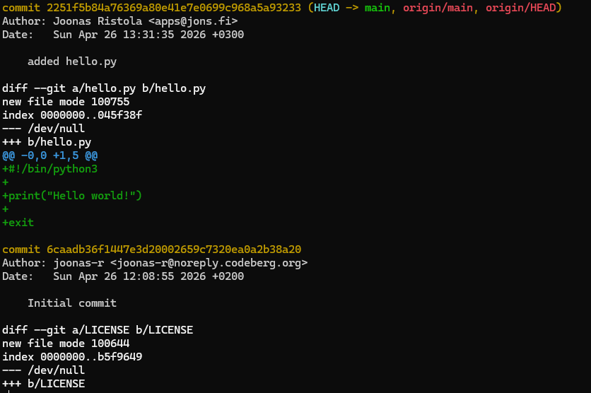

## e - ansible

Kopioidaan ansible-kansio sunshine kansioon:

Menin virtuaalikoneelleni, otin sen ssh julkisen avaimen talteen, ja lisäsin sen Codebergin käyttäjäni ssh-avain -listaan.

Asensin gitin virtuaalikoneelle ja konfiguroin sähköpostin ja nimen. 

Kopioin tietovaraston koneelleni `git clone` komennolla.

    cp -r ansible/ sunshine/

Sitten tarkastelin luomiani rooleja.

    cd sunshine/ansible/roles
    ls
        apache  hello  newfile  nginx  paketit  sudoadmin  ufw

Voisin muokata paketit-roolia.

`tasks.yml` vanha: 

    - apt:
    update-cache: true
    name: 
    - ufw
    - wget
    state: latest  

tasks.yml uusi: 

    - name: apt update and upgrade 
      apt:
        update-cache: true
        upgrade: yes

`sunshine/ansible/main.yml`

    - hosts: all
      become: true
      roles:
        - ufw 
        - sudoadmin
        - paketit

Sitten ajoin pelikirjan

    ansible-playbook -u j-ansible --become site.yml

Kaikki ok. Tallensin sitten paikalliseen Git tietokantaan

    git add --all
    git commit -m "Ansible-folder with a few roles"
    git pull
    git push

Ansible-kansio tuli näkyviin Codebergiin.

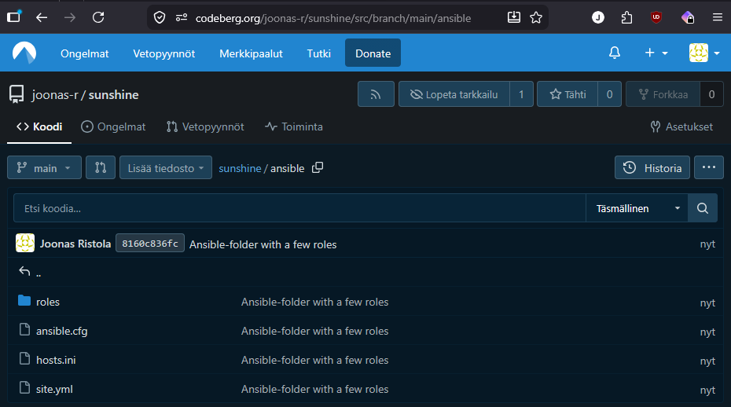

Päivitin lopuksi vielä readme-tiedostoa.

    micro README.md
    git add README.md
    git commit
    git pull
    git push

## f - projekti

Pari on löytynyt projektiin