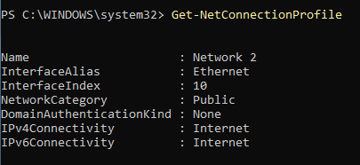
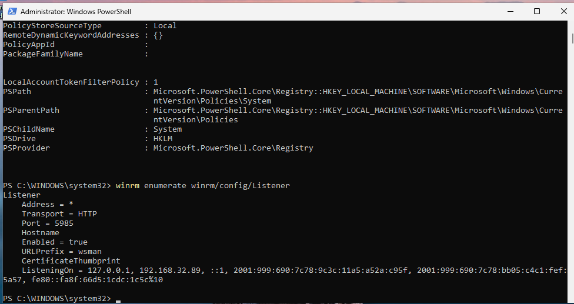
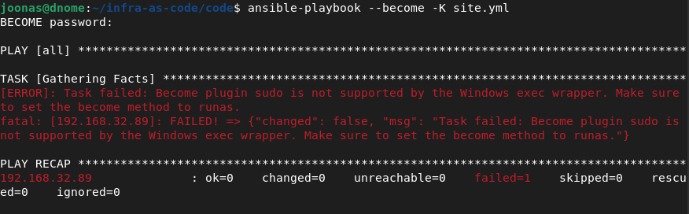
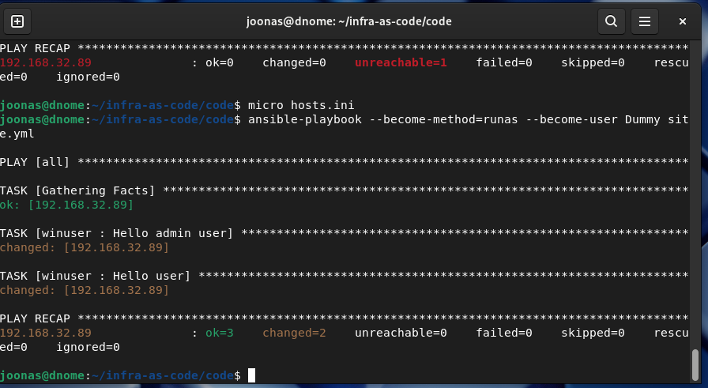
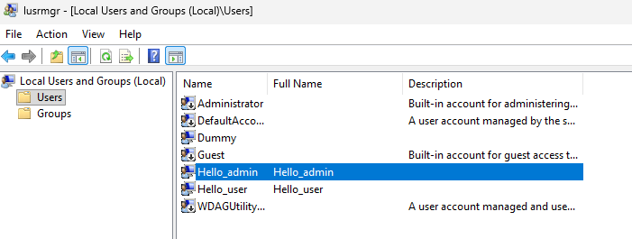
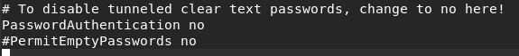
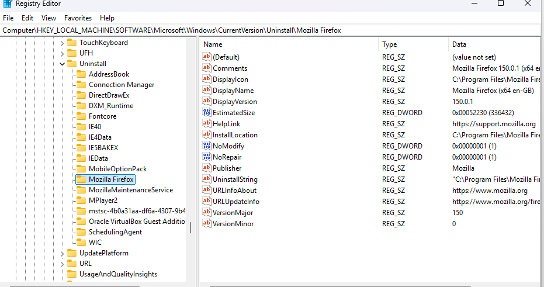

Asiat, joita haluan windows koneelle tehtävän, kun se asennetaan ensimmäistä kertaa:

- Poista bing haku Windows 11 hausta
- poista copilot
- poista edge; asenna firefox
- luo uusi käyttäjä: admin
- luo uusi käyttäjä: user (non admin)
- lisää ssh avaimet käyttäjille
- firewall päälle, portit auki 22
- päivitä Windows updaten kautta

# Ensin normaalisti

Out of the Box experience tulee Windowsilla joka kerta, jos ei tee unattend xml-tiedostoa. Tämä kohta on vaikea automatisoida Ansiblella, sillä esim. Winget-moduulia ei ole asennettu Windowsiin vielä tässä vaiheessa, eikä siten ssh-yhteyttä pääse muodostamaan.

Windowsilla on myös monta eri tapaa ottaa se käyttöön (Autopilot, MDT, valmis levykuva), joten tätä vaihetta ei ole mielestäni järkevääkään yrittää Ansiblen kanssa tehdä.

https://learn.microsoft.com/en-us/windows-hardware/manufacture/desktop/update-windows-settings-and-scripts-create-your-own-answer-file-sxs?view=windows-11

Shift + F10 ja komento `oobe\bypassnro`, niin ei tarvitse kirjautua Microsoft-tilillä. Komennon jälkeen verkkojohto pitää irrottaa, että asennus jatkuu paikallisen tilin kanssa.


GUI install: 
System > Optional Features > View or edit optional features > See available features > OpenSSH server

Powershell install: 
    Add-WindowsCapability -Online -Name OpenSSH.Server

SSH yhteyttä ei saanut muodostettua virtuaalikoneeseen, joten muutin virtuaalikoneen verkkoadapterin asetuksia. 

Bridged connection, Promiscuous mode: Deny

Lisäksi hyväksyin Windowsin palomuurista liikenteen porttiin 22. Tämän jälkeen sain yhdistettyä ssh:lla koneelle. 

## Ansiblella yhdistäminen 

Yritetin sitten ajaa Ansible playbookin, jossa luodaan uudet käyttäjät:

    "Task failed: Failed to create temporary directory. In some cases, you may have been able to authenticate and did not have permissions on the target directory. Consider changing the remote tmp path in ansible.cfg to a path rooted in \"/tmp\", for more error information use -vvv. Failed command was: _ShellCommand(command='( umask 77 && mkdir -p \"` echo ~/.ansible/tmp `\"&& mkdir \"` echo ~/.ansible/tmp/ansible-tmp-1777916858.4233713-4387-2107777678006 `\" && echo ansible-tmp-1777916858.4233713-4387-2107777678006=\"` echo ~/.ansible/tmp/ansible-tmp-1777916858.4233713-4387-2107777678006 `\" )', input_data=None), exited with result 1", "unreachable": true

Katsotaan dokumentaatiosta, miten Windows-hostien kanssa toimitaan. 

https://docs.ansible.com/projects/ansible/latest/os_guide/windows_setup.html

Dokumentaatiosta selviää, että Ansible Windows-hosteilla käyttää SSH:n sijasta WinRM-protokollaa. 

Asennetaan pywinrm python plugin Ansiblelle:

Tarvitaan pip ja pipx

    sudo apt install python3-pip pipx
    pipx install ansible
    pipx inject ansible "pywinrm>=0.4.0"

        Note: ansible-community was already on your PATH at /usr/bin/ansible-community
        installed package ansible 13.6.0, installed using Python 3.13.5
        These apps are now globally available
        - ansible-community
        ⚠️  Note: '/home/joonas/.local/bin' is not on your PATH environment variable. These apps will
        not be globally accessible until your PATH is updated. Run `pipx ensurepath` to
        automatically add it, or manually modify your PATH in your shell's config file (e.g.
        ~/.bashrc).

    pipx ensurepath

Tarkastin dokumentaatiosta löytyvän powershell scriptin, ja kopioin sen windows-koneelle. 

    # Enables the WinRM service and sets up the HTTP listener
    Enable-PSRemoting -Force

    # Opens port 5985 for all profiles
    $firewallParams = @{
        Action      = 'Allow'
        Description = 'Inbound rule for Windows Remote Management via WS-Management. [TCP 5985]'
        Direction   = 'Inbound'
        DisplayName = 'Windows Remote Management (HTTP-In)'
        LocalPort   = 5985
        Profile     = 'Any'
        Protocol    = 'TCP'
    }
    New-NetFirewallRule @firewallParams

    # Allows local user accounts to be used with WinRM
    # This can be ignored if using domain accounts
    $tokenFilterParams = @{
        Path         = 'HKLM:\SOFTWARE\Microsoft\Windows\CurrentVersion\Policies\System'
        Name         = 'LocalAccountTokenFilterPolicy'
        Value        = 1
        PropertyType = 'DWORD'
        Force        = $true
    }
    New-ItemProperty @tokenFilterParams    

Ennen kun scripti ajetaan, pitää hyväksyä kustomoitujen skriptien ajaminen: `Set-ExecutionPolicy RemoteSigned Process`

Virheilmoitus scriptiä ajettaessa: 

    WinRM firewall exception will not work since one of the network connection types on this machine is set to Public. Change the network connection type to either Domain or Private and try again.

Vaihdetaan verkkoprofiili:



    Set-NetConnectionProfile -NetworkCategory Private

Tämän jälkeen scriptiä ajettaessa palomuuriavaukset menivät läpi (`New-NetFirewallRule`) ja WinRM palvelu lähti käyntiin (`Enable-PSRemoting`)

Listeners: 

    winrm enumerate winrm/config/Listener



Kunnossa, tämä luodaan automaattisesti kun komento `Enable-PSRemoting` ajetaan.

NTLM authentication, host variables: 

    [all:vars]
    ansible_user=Dummy
    tempdir='C:\Windows\Temp'

    # winrm
    ansible_connection=winrm
    ansible_winrm_transport=ntlm

    ansible_python_interpreter=auto_silent

Uusi virheilmoitus



    ansible-playbook --become-method=runas

        [ERROR]: Task failed: Required config 'become_user' for 'runas' become plugin not provided.
        fatal: [192.168.32.89]: FAILED! => {"changed": false, "msg": "Task failed: Required config 'become_user' for 'runas' become plugin not provided."}


Lisäsin käyttäjän salasanan ansible_password variableen, jonka jälkeen tunnistautuminen onnistui seuraavalla komennolla

    ansible-playbook --become-method=runas --become-user Dummy site.yml

Seuraavaksi tyssää siihen, että HTTPS ei ole käytössä. HTTPS:n käyttö on tosin toivottua, mutta haluan kokeilla toimiiko yhteys laisinkaan. Joten orja-windowsilla: 

    Set-Item -Path WSMan:\localhost\Service\AllowUnencrypted -Value $true

Muutin vielä hosts.ini -tiedostossa käyttämään porttia 5985, joka on WinRM:n HTTP portti.

Playbook meni läpi



Muutin yllä olevan AllowUnencrypted avaimen takaisin $false tilaan ja kokeilin uudelleen.

Toimii edelleen. 

#### WinRM HTTP toimiva konfiguraatio

Hosts.ini

    192.168.32.89:5985

    [all:vars]
    ansible_user=Dummy
    ansible_password=Dummy
    tempdir='C:\Windows\Temp'

    # winrm
    ansible_connection=winrm
    ansible_winrm_transport=ntlm

    ansible_python_interpreter=auto_silent

Playbook komento: `ansible-playbook --become-method=runas --become-user Dummy site.yml`

Käyttäjät hallittavalla -koneella pelikirjan jälkeen



## Ansible SSH yhteydellä

Myös SSH:lla saa muodostettua yhteyden. Tämä on tietoturvallisempaa kuin salasanojen säilyttäminen variables-tiedostossa. Paras vaihtoehto olisi käyttää WinRM HTTPS-protokollan yli, mutta tämän konfigurointiin menisi liian kauan projektin laajuuteen nähden. 

    192.168.32.89:22

    [all:vars]
    ansible_user=Dummy
    ansible_password=Dummy
    tempdir='C:\Windows\Temp'

    # ssh
    ansible_connection=ssh
    ansible_shell_type=powershell

Rooli joka tekee uudet käyttäjät ja profiilit

    - name: Hello admin user
      ansible.windows.win_user:
        name: Hello_admin
        groups: Administrators
        groups_action: add
        password: D3moPa55worD
        update_password: on_create
        state: present

    - name: Hello admin profile
      ansible.windows.win_user_profile: 
        name: hello_admin
        username: Hello_admin
        state: present
        
    - name: Hello user
      ansible.windows.win_user:
        name: Hello_user
        groups: Users
        groups_action: add
        password: userPWD9
        update_password: on_create
        state: present

    - name: Hello user profile
      ansible.windows.win_user_profile: 
        name: hello_user
        username: Hello_user
        state: present
    
Rooli korjaamaan ssh asetukset

    - name: Enable OpenSSH
      ansible.windows.win_service: 
        name: sshd
        start_mode: auto
        state: started

    - name: create ssh folder
      ansible.windows.win_file: 
        path: C:\Users\hello_admin\.ssh
        state: directory
    notify: change ssh folder owner
        
    - name: Copy public key to hello_admin
      ansible.windows.win_copy:
        content: 'ssh-ed25519 AAAAC3NzaC1lZDI1NTE5AAAAIA53k0Y1u1D+3QM5hxADtvXcuNkvvRyHXecUHNKKd0+g joonas@dnome'
        dest: C:\Users\hello_admin\.ssh\authorized_keys
        force: false
    notify: change ssh folder owner

    - name: disallow password login on remote host
    ansible.windows.win_copy:
        src: sshd_config 
        dest: '%ProgramData%\ssh\sshd_config'
        force: True
    notify: restart sshd

SSH config muutos:



SSH ei vielä toimi, koska Windowsilla oletusasetuksena on päällä, että Administrator ryhmän käyttäjien avaimet säilytetään ProgramData\ssh\administrators_authorized_keys tiedostossa.

Kun muutin tuon polun taskiin, alkoi toimimaan ilman salasanaa.


### Remove Bing search

Muutin seuraavaa rekisteriavainta, joka estää Bingin käytön Windowsin haussa local GPO:n avulla.

    - name: Add registry entry to disable bing search
      ansible.windows.win_regedit: 
        path: HKLM:\SOFTWARE\Policies\Microsoft\Windows\Windows Search
        name: ConnectedSearchUseWeb
        data: 0
        type: dword

Tämä ei kuitenkaan vaikuttanut Bing haun toimintaan... Hienoa Microsoft. 

Varmistin asian käymällä muuttamassa Local Group Policy Editorissa muuttamassa saman asetuksen, mutta Bing haku edelleen näkyy 

Näillä rekisteriavaimilla toimii, mutta tämä on HKCU eli muokkaa nykyisen käyttäjän asetuksia. Jos haluan laittaa käyttöön hello_user käyttäjälle, pitää löytää SID jota muokata.

    - name: Change local settings to disable bing search
      ansible.windows.win_regedit: 
        path: HKCU:\Software\Microsoft\Windows\CurrentVersion\SearchSettings
        name: IsGlobalWebSearchProviderToggleEnabled
        data: 0
        type: dword

    - name: Change local settings to disable bing search 2
      ansible.windows.win_regedit: 
        path: HKCU:\Software\Microsoft\Windows\CurrentVersion\SearchSettings
        name: HasSetWebSearchEnabledStateOnUpdate
        data: 0
        type: dword

Kokeillaan jotain muuta ensin.

Poistetaan Bing, Copilot ja Edge, asennetaan Firefox

Kaikki Bingiin liittyvän löysin Powershell komennolla

    Get-AppxPackage | where -Property Name -match "Microsoft.Bing*"

Poistetaan Bing sovellukset

    - name: Delete Bing apps
      ansible.windows.win_package: 
        product_id: "{{ item.product_id }}"
        state: absent
        provider: auto 
      loop:
        - { product_id: 'Microsoft.BingSearch'}
        - { product_id: 'Microsoft.BingWeather'}
        - { product_id: 'Microsoft.BingNews' }

Edgen poistaminen ei onnistu komentoriviltä...

    - name: Delete Edge
    ansible.windows.win_package:
    #   product_id: '{56EB18F8-B008-4CBD-B6D2-8C97FE7E9062}'
        product_id: 'Microsoft Edge'
    #   path: 'C:\Program Files (x86)\Microsoft\Edge\Application\147.0.3912.98\Installer\setup.exe'
    #   arguments: --uninstall --msedge --system-level
        state: absent
        provider: auto

Antaa virheen: 

    Module failed: unexpected rc from '"C:\Program Files (x86)\Microsoft\Edge\Application\147.0.3912.98\Installer\setup.exe" --uninstall --msedge --system-level': see rc, stdout, and stderr for more details

Ja system logeissa löytyy virhe: 

    Uninstall was blocked for this product: 532

Varmasti rekisteriä puukottamalla saisi poistettua.

### Firefoxin asennus

Asennetaan käsin ja katsotaan minkä niminen Rekisteriavain tulee Uninstall kansioon. 

Kansion nimi = product_id, koska tämä on exe asennuspaketti



    - ansible.windows.win_copy:
        src: 'Firefox Installer.exe'
        dest: 'C:\temp'

    - name: Install Firefox
      ansible.windows.win_package: 
        path: 'C:\temp\Firefox Installer.exe'
    #   product_id: Mozilla Firefox
    #   provider: registry
        creates_path: 'C:\Program Files\Mozilla Firefox'
        state: present
        arguments: /S
        wait_for_children: true

Tämä ei toiminut, asennus ei koskaan lähtenyt käyntiin. Msi paketilla toimii!

    - name: Install Firefox
      ansible.windows.win_package: 
        path: 'https://download.mozilla.org/?product=firefox-msi-latest-ssl&os=win64&lang=en-US'
        product_id: "Mozilla Firefox"
        creates_path: 'C:\Program Files\Mozilla Firefox'
        state: present
        arguments: /quiet
        wait_for_children: true

Lisäsin vielä säännön tarkistamaan, että kone, jolla skriptiä ajetaan on todella Windows-kone. 

    when: ansible_os_family == "Windows"

Ja muutin variablet hosts tiedostoon. Niitä voi kutsua koodissa `"{{variablen_nimi}}"`

    [windows]
    192.168.32.89:22

    [windows:vars]

    tempdir='C:\Windows\Temp'
    ansible_connection=ssh
    ansible_shell_type=powershell
    win_admin=hello_admin
    win_user=hello_user
    win_admin_pass=<salasana>
    win_user_pass=<salasana>


## How to get it working

Hallittava kone tarvitsee: 
- Windows 11 asennuksen, jossa käyttäjällä on admin-oikeudet.
- OpenSSH
  - Ominaisuuden asennus
  - Palvelun käynnistys
  - Palomuurin portin avaus
- Jos teet virtuaalikoneella
  - Yhteinen NAT tai Bridged verkko

Ansiblen konfiguraatio:

- Ansible käyttää Windows-hallittavissa koneissa oletusarvoisesti WinRM-protokollaa. 
  - Tämä mahdollistaa hallinnan HTTPS protokollan kautta. 
  - WinRM on Windows Serverissä oletusarvoisesti päällä, mutta ei välttämättä tavallisilla Windows-koneilla. (Ansible.)
  - TCP port 5985 for HTTP and TCP port 5986 for HTTPS (SSL/TLS) (Microsoft)
- WinRM vaatii ylimääräistä konfigurointia Ansiblen puolelta
  - pywinrm moduuli
  - SSL/TLS Sertifikaatit
  - ```ansible_connection=winrm \ ansible_winrm_transport=ntlm```

Onneksi toimii myös SSH:n kautta
  - Määritä käyttämään ssh porttia 22
    - <ip-osoite>:22
  - Määritä käyttämään ssh-yhteyttä
    - ```ansible_connection=ssh \ ansible_shell_type=powershell```
(Ansible.)

Ansible: https://docs.ansible.com/projects/ansible/latest/os_guide/windows_winrm.html

Microsoft: https://learn.microsoft.com/en-us/windows/win32/winrm/installation-and-configuration-for-windows-remote-management

Käyttämäni moduulit: 
- ansible.windows.win_user
- ansible.windows.win_user_profile
- ansible.windows.win_service
- ansible.windows.win_copy
- ansible.windows.win_region
- ansible.windows.win_timezone
- ansible.windows.win_updates
- ansible.windows.win_package


Preconfiguration: 

- Lataa ISO tiedosto: https://www.microsoft.com/fi-fi/software-download/windows11
- Virtuaalikoneen minimi: 2 prosessoria, 4gb ramm, 60gb tallennustilaa
- Varmista että ulkoiselta koneelta on yhteys virtuaalikoneeseen:
  - NAT Network / Bridged adapter
- Käytä Windows ISO kuvaa virtuaalikoneen levykuvana
- Windows-asennus
    - Jos haluat paikallisen käyttäjän: Kirjautumisen kohdalla, Shift+F10, `oobe\bypassnro` ja irroita verkkoyhteys
    - Käyttäjällä pitää olla salasana
- Yhdistä kone verkkoon
- Powershell: Run as admin

```
Add-WindowsCapability -Online -Name OpenSSH.Server*
Start-Service -Name sshd
New-NetFirewallRule -Name 'ssh-in-TCP' -DisplayName 'Inbound rule for SSH Server (sshd) on TCP port 22' -Action Allow -Direction Inbound -Enabled True -Profile Any -Protocol 'TCP' -LocalPort 22
```

# Parannusehdotuksia

Parannuksia: 
- Voisi poistaa oletuskäyttäjät
- Bing poistaminen kaikilta käyttäjiltä
- Bitlocker asennus koneelle, jos ei ole (tiedosto kansiossa)
- Tarkistaa mitkä palvelut käytössä ja sulkea turhat
- Käydä palomuurin säännöt läpi
- User Access Control kuntoon (registry?) 
- Chocolatey paketinhallinta?
- WinRM over HTTPS

